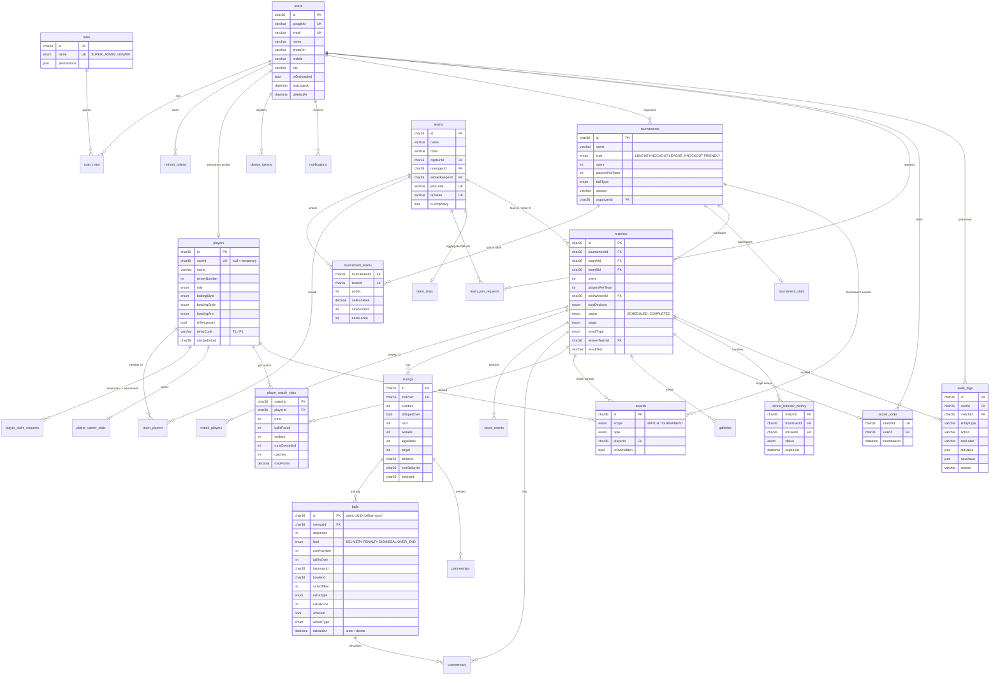

# Database ER Diagram

MySQL 8 / MariaDB 10.4+ (`cricket` database). All primary keys are UUID `CHAR(36)`; main entities are soft-deleted through `deletedAt`. Source of truth: [`prisma/schema.prisma`](../prisma/schema.prisma).

## Design notes

- **Ball log is the source of truth.** `innings` totals, `partnerships`, `player_match_stats` and ball numbering are derived by replaying non-deleted `balls` in `sequence` order (`src/modules/scoring/engine/scoring-engine.ts`). Undo / edit / delete therefore always leave consistent data.
- **Offline sync.** `balls.id` is generated by the Android client, so resubmitting a ball is idempotent.
- **Career & tournament statistics** are recomputed from `player_match_stats` of *completed* matches after every result (background job), so corrections and record claims propagate automatically.
- **Scorer lock.** `scorer_locks.matchId` is unique (one scorer per match); Redis caches the holder and serialises concurrent writes.

---
Developed by Sling Groups
